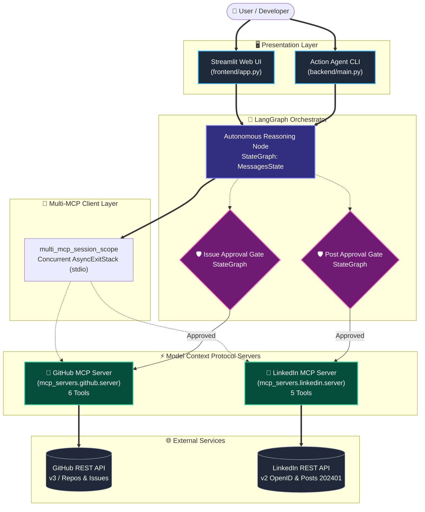
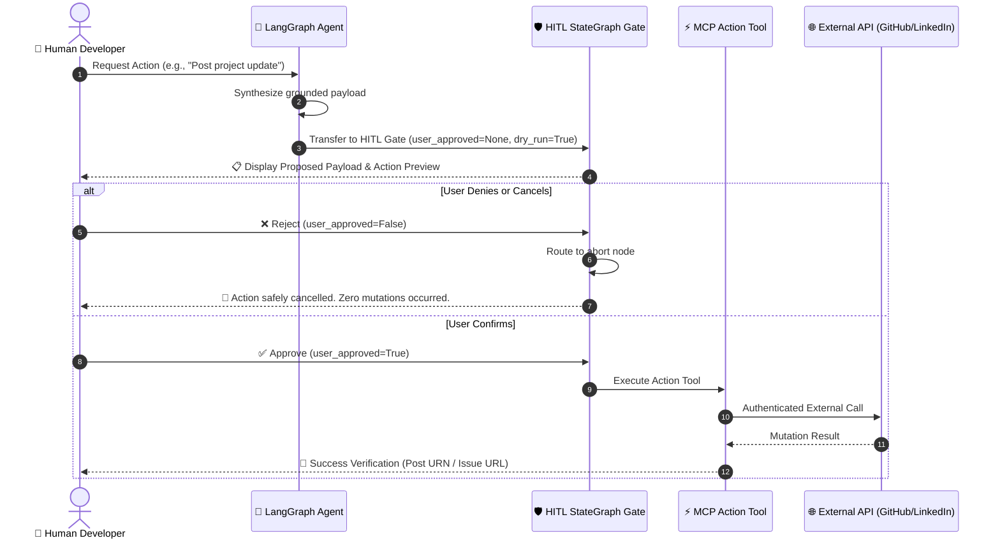

<div align="center">

# 🚀 Personal AI Action Agent
### *Autonomous Multi-MCP Architecture for GitHub & LinkedIn*

<p align="center">
  <a href="https://readme-typing-svg.demolab.com">
    
  </a>
</p>

[](https://python.org)
[](https://modelcontextprotocol.io/)
[](https://langchain-ai.github.io/langgraph/)
[](https://streamlit.io/)
[](https://www.trychroma.com/)
[](file:///e:/GITHUB_MCP/tests)
[](LICENSE)

<br/>

[🌟 Overview](#-overview) •
[🏗️ Architecture](#-system-architecture) •
[🛠️ 11 MCP Tools](#-11-mcp-tools-suite) •
[🛡️ HITL Safety Gates](#-safety--human-in-the-loop-hitl) •
[💻 Web Interface](#-interactive-web-dashboard) •
[⚡ Quickstart](#-quickstart) •
[🧪 Verification](#-automated-testing)

---

</div>

<br/>

## 🌟 Overview

The **Personal AI Action Agent** is a multi-service AI application built on the **Model Context Protocol (MCP)**, **LangGraph**, and **Retrieval-Augmented Generation (RAG)**. 

It safely bridges an autonomous AI agent with external development and professional networks:
* 🔍 **Repository Improvement Agent**: Gathers live tree metadata and AST configurations, runs semantic RAG queries, drafts a comprehensive 12-section `README.md`, and interactively proposes targeted GitHub issues.
* 📢 **Developer Post Synthesizer**: Extracts real repository architecture, highlights genuine technical challenges, generates optional graphics, and publishes authentic developer updates to LinkedIn.
* 💼 **Qualitative Profile Auditor**: Evaluates developer headlines, summaries, and skill stacks with high-impact, narrative recommendations (**strictly zero gimmicky numerical scores**).
* 🛡️ **Absolute Mutation Safety**: Every external write operation (`create_issue`, `create_post`, `delete_post`, `update_profile`) defaults to `dry_run=True` and requires explicit human approval via LangGraph state gates.

---

## 🏗️ System Architecture



---

## 🛠️ 11 MCP Tools Suite

All tools are standard JSON-RPC 2.0 endpoints registered over `stdio` via `FastMCP`. They are automatically loaded into LangChain tools using `langchain-mcp-adapters`.

### 🐙 1. GitHub MCP Server (`mcp_servers.github.server`)
| # | Tool Name | Parameters | Safety / Mode | Description |
|:---:|:---|:---|:---:|:---|
| `01` | `get_repository` | `repo_url` | 🟢 Read-Only | Fetches metadata (stars, forks, primary language, license). |
| `02` | `get_repository_tree` | `repo_url`, `branch?`, `filter_ignored?` | 🟢 Read-Only | Recursive file tree filtering build noise (`node_modules`, `dist`, binaries). |
| `03` | `read_file` | `repo_url`, `file_path`, `branch?` | 🟢 Read-Only | Reads file contents with strict byte guardrails. |
| `04` | `search_repository` | `repo_url`, `query`, `max_results?` | 🟢 Read-Only | Code & documentation search with path hierarchy fallback. |
| `05` | `get_issues` | `repo_url`, `state?`, `max_issues?` | 🟢 Read-Only | Queries existing open/closed community issues. |
| `06` | `create_issue` | `repo_url`, `title`, `body`, `dry_run?` | 🔴 **HITL Action** | Creates a GitHub issue (requires human confirmation). |

### 💼 2. LinkedIn MCP Server (`mcp_servers.linkedin.server`)
| # | Tool Name | Parameters | Safety / Mode | Description |
|:---:|:---|:---|:---:|:---|
| `07` | `get_profile` | `raw?` | 🟢 Read-Only | Fetches verified identity via OpenID Connect (`GET /v2/userinfo`). |
| `08` | `analyze_profile` | `headline?`, `about?`, `skills?`, `projects?` | 🟢 Read-Only | Descriptive career feedback (**strictly no numerical scores**). |
| `09` | `create_post` | `content`, `image_url?`, `dry_run?` | 🔴 **HITL Action** | Publishes posts via official REST API (`POST /rest/posts`). |
| `10` | `delete_post` | `post_id`, `dry_run?` | 🔴 **HITL Action** | Destructive action: Deletes post via `/rest/posts/{urn}`. |
| `11` | `update_profile` | `headline?`, `about?`, `dry_run?` | 🔴 **HITL Action** | Prepares diffs & transparently enforces official API constraints. |

---

## 🛡️ Safety & Human-in-the-Loop (HITL)

> [!IMPORTANT]
> **Zero Accidental External Mutations**
> No issue is created on GitHub and no post is published on LinkedIn without passing through an explicit Human-in-the-Loop (HITL) approval gate.



---

## 💻 Interactive Web Dashboard

The application includes a 7-tab Streamlit dashboard:

<div align="center">

| Tab | Feature | Description |
|:---:|:---|:---|
| **1** | 📊 **Audit & Improvements** | Factual health check, documentation score, and prioritized suggestions. |
| **2** | 📝 **Generated README** | Complete 12-section production `README.md` with instant copy-to-clipboard. |
| **3** | 📂 **Repository Tree** | Interactive directory tree with size breakdowns and noise filtering. |
| **4** | 🛡️ **Propose Issue (HITL)** | Interactive issue drafting with dry-run verification and manual execution. |
| **5** | 📢 **Post to LinkedIn (HITL)** | Grounded developer post generation with live preview and approval gate. |
| **6** | 💼 **LinkedIn Profile Auditor** | Strategic profile optimization suggestions without gimmicky scoring. |
| **7** | 💬 **Ask Multi-MCP Agent** | Interactive agent capable of cross-service reasoning across GitHub and LinkedIn. |

</div>

---

## ⚡ Quickstart

### 1. One-Click Launch (Windows)
Double-click `start_all.bat` or run:
```powershell
.\start_all.bat
```
*Automatically validates your environment, activates virtual environments, opens `http://localhost:8501`, and boots the server.*

---

### 2. Manual Setup

#### Clone & Install Dependencies
```powershell
git clone https://github.com/your-username/Personal-AI-Action-Agent.git
cd Personal-AI-Action-Agent
pip install -r requirements.txt
```

#### Configure Environment
Copy `.env.example` to `.env`:
```powershell
copy .env.example .env
```

Configure your credentials in `.env`:
```ini
# GitHub Token (5,000 req/hr)
GITHUB_TOKEN=ghp_your_github_token_here

# LLM Providers (Google Gemini, OpenAI, or Groq)
GOOGLE_API_KEY=your_gemini_api_key
GROQ_API_KEY=your_groq_api_key

# LinkedIn Integration (set LINKEDIN_MOCK=true for instant offline testing)
LINKEDIN_MOCK=true
LINKEDIN_CLIENT_ID=
LINKEDIN_CLIENT_SECRET=
LINKEDIN_ACCESS_TOKEN=
```

#### Start the Streamlit Web Application
```powershell
streamlit run frontend/app.py
```

---

### 3. Command-Line Interface (CLI)

#### Audit a GitHub Repository:
```powershell
python backend/main.py octocat/Hello-World
```

#### Draft a Grounded LinkedIn Post:
```powershell
python backend/main.py --post octocat/Hello-World
```

#### Run Profile Audit:
```powershell
python backend/main.py --profile
```

#### Query the Autonomous Multi-MCP Agent:
```powershell
python backend/main.py --agent "Inspect octocat/Hello-World and draft an elevator pitch for my LinkedIn summary"
```

*Add `-y` / `--yes` to auto-approve prompts non-interactively (defaults to safe dry-run mode).*

---

## 🧪 Automated Testing

All features, MCP tool discovery handshakes, and HITL state flows are covered by comprehensive automated tests:

```powershell
# Run the entire test suite
pytest -v

# Run targeted MCP server tests
pytest tests/test_linkedin_mcp.py tests/test_mcp_phase8.py -v
```

<details>
<summary><b>🔍 Click to view Test Suite Coverage (100% Passing)</b></summary>

```text
============================= test session starts =============================
platform win32 -- Python 3.12.6, pytest-9.1.1, pluggy-1.6.0
collected 35 items

tests/test_github_tools.py .........................                    [ 71%]
tests/test_linkedin_mcp.py ............                                 [ 85%]
tests/test_mcp_phase1.py .                                              [ 88%]
tests/test_mcp_phase2.py .                                              [ 91%]
tests/test_mcp_phase6.py ...                                            [ 97%]
tests/test_mcp_phase8.py .                                              [100%]

======================== 35 passed in 14.22s (100%) ========================
```
</details>

---

## 🔒 Security & Privacy Guarantees

* 🛡️ **Zero Browser Scraping**: Adheres 100% to LinkedIn's developer terms. No Selenium, Playwright, or cookie extraction.
* 🔐 **Secret Redaction**: Zero API keys or tokens are ever embedded in prompts, logs, or source code.
* 📦 **Decoupled Architecture**: Subprocesses communicate exclusively through standard JSON-RPC 2.0 messages over `stdio`.

---

<div align="center">

Built with ❤️ using **LangGraph**, **Model Context Protocol (MCP)**, and **Streamlit**.

</div>
